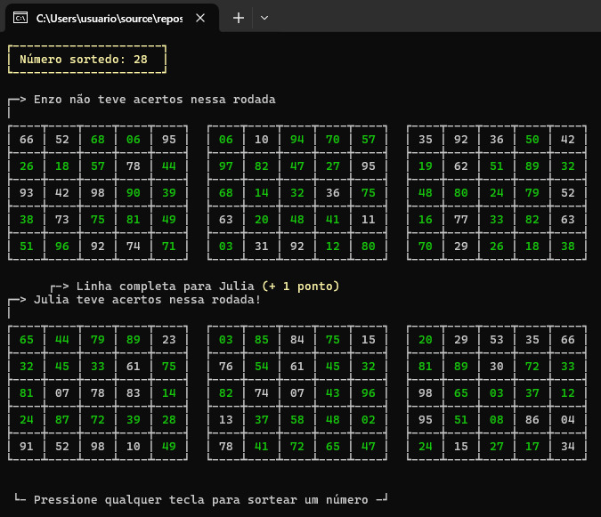

# Bingo!
Jogo de Bingo para terminal com quantidade variável de jogadores e cartelas.

## Fluxo de desenvolvimento:
- Definição de dados necessários
- Lógica dos sorteios e conferência das cartelas 
- Controle das variáveis da rodada
- Controle de parada e final da partida
- Exibição dos resultados

## Estrutura de dados utilizada:
Para lidar com os dados da partida foi utilizada uma estrutura baseada em vetores sem a utilização de objetos.

#### Jogadores: 
- A quantidade de jogadores é armazenada em "playersCount", a ordem que são inseridos os jogadores define o seu identificador
- O indice 0 de qualquer vetor que carrega dados representa o primeiro jogador inserido e assim sucetivamente
- Cada jogador possui um conjunto de cartelas e um nome que é armazenado no vetor "playersName" 
- A quantidade de cartelas é armazenada em "cardsCount" que é definida no inicio do código assim como o número de jogadores: 

#### Cartelas
- O vetor de matrizes(5x5) "playerCards" armazena todas as cartelas de todos os jogadores, cada matriz é uma cartela
- As cartelas são criadas pela função "PopulateAllPlayerCards" que na sua execução popula as cartelas com números aleatórios não repetidos
- Cada cartela possui uma máscara, armazenada em "playerCardsMask", as máscaras são matrizes de 5x5 somente com 0s e 1s
- Cada acerto na cartela do jogador é marcado na máscara com o número 1, sendo assim avaliado os números na cartela e marcado na máscara para persistência dos dados
- O vetor "cardsIndexList" armazena as posições das cartelas de cada jogador para que não fosse necessário criar mais uma profundida em "playerCards"

#### Sorteador e Placar
- "numbersToBeDrawn" é um vetor com números de 1 a 99 que não se repetem
- Ao sortear um número com a função "CallNumberFromNumbersToDraw" o sorteado é substituido por 0 e ignorado no próximo sorteio
- A função "resetNumbers" restaura todos os números de 1 a 99
- No vetor "playerPoints" cada indice armazena a pontuação de um jogador
- A exibição do scoreboard final é feita com a função "PrintScoreboard"
